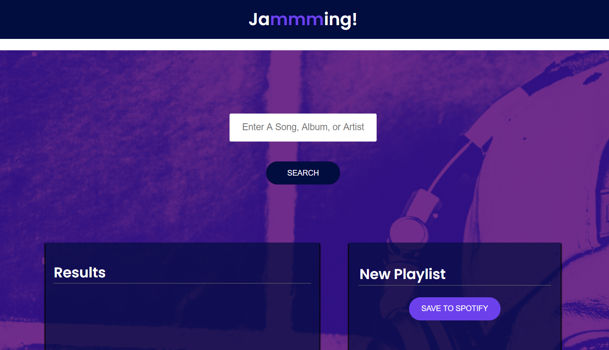

# Jammming
## [A Codecademy Project](https://www.codecademy.com/paths/web-development/tracks/front-end-applications-with-react/modules/jammming/projects/jammming-prj)

## Links
Deployed with Surge: [http://jammmingwithjd.surge.sh/](http://jammmingwithjd.surge.sh/)  
Github Repository: [https://github.com/jdmarty/jammming](https://github.com/jdmarty/jammming)

## How To Use
### Basics
- This app uses your own Spotify account to create new playlists. If you do not have a Spotify account you will need to create one to use this app.
- If you are not already logged in, the site will redirect you to an approval page. Once you have given approval for this website to access your account, you will be redirected back to the main page.
### Search
- Type the name of any song, album, or artist that you would like to search for in the Spotify library
- Click the enter button. Songs will be populated in the Results panel.
### Create a Playlist
- After searching, click the "+" button next to a song in the Results panel to add it to your new playlist.
- To remove a song from your new playlist, click the "-" button next to that song.
- Update the name of your new playlist in the "New Playlist" input field at the top of the Playlist panel.
- Once you are satisfied with the name and songs in your playlist, click the "SAVE TO SPOTIFY" button.
- Check your Spotify account. Your new playlist should now be saved to your account! If you refresh the Jammming app, you should also see the new playlist in the "My Playlists" tab at the bottom of your screen"
### My Playlists
- This app will automatically load your existing playlists from Spotify. They will be displayed in the "My Playlists" tab at the bottom of your screen.
- Click any of these playlists to automatically load your existing tracks to the Playlists panel. From here you can add and remove songs from your playlists.
- NOTE editing existing playlists in this app will not change your saved playlist in Spotify. It will instead create an entirely new playlist for your account.

---

This project was bootstrapped with [Create React App](https://github.com/facebook/create-react-app).

## Available Scripts

In the project directory, you can run:

### `npm start`

Runs the app in the development mode. 
Open [http://localhost:3000](http://localhost:3000) to view it in the browser.

The page will reload if you make edits. 
You will also see any lint errors in the console.

### `npm test`

Launches the test runner in the interactive watch mode. 
See the section about [running tests](https://facebook.github.io/create-react-app/docs/running-tests) for more information.

### `npm run build`

Builds the app for production to the `build` folder. 
It correctly bundles React in production mode and optimizes the build for the best performance.

The build is minified and the filenames include the hashes. 
Your app is ready to be deployed!

See the section about [deployment](https://facebook.github.io/create-react-app/docs/deployment) for more information.

### `npm run eject`

**Note: this is a one-way operation. Once you `eject`, you can’t go back!**

If you aren’t satisfied with the build tool and configuration choices, you can `eject` at any time. This command will remove the single build dependency from your project.

Instead, it will copy all the configuration files and the transitive dependencies (webpack, Babel, ESLint, etc) right into your project so you have full control over them. All of the commands except `eject` will still work, but they will point to the copied scripts so you can tweak them. At this point you’re on your own.

You don’t have to ever use `eject`. The curated feature set is suitable for small and middle deployments, and you shouldn’t feel obligated to use this feature. However we understand that this tool wouldn’t be useful if you couldn’t customize it when you are ready for it.

## Learn More

You can learn more in the [Create React App documentation](https://facebook.github.io/create-react-app/docs/getting-started).

To learn React, check out the [React documentation](https://reactjs.org/).

### Code Splitting

This section has moved here: https://facebook.github.io/create-react-app/docs/code-splitting

### Analyzing the Bundle Size

This section has moved here: https://facebook.github.io/create-react-app/docs/analyzing-the-bundle-size

### Making a Progressive Web App

This section has moved here: https://facebook.github.io/create-react-app/docs/making-a-progressive-web-app

### Advanced Configuration

This section has moved here: https://facebook.github.io/create-react-app/docs/advanced-configuration

### Deployment

This section has moved here: https://facebook.github.io/create-react-app/docs/deployment

### `npm run build` fails to minify

This section has moved here: https://facebook.github.io/create-react-app/docs/troubleshooting#npm-run-build-fails-to-minify
